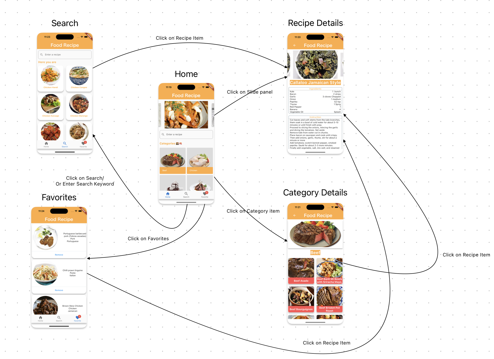
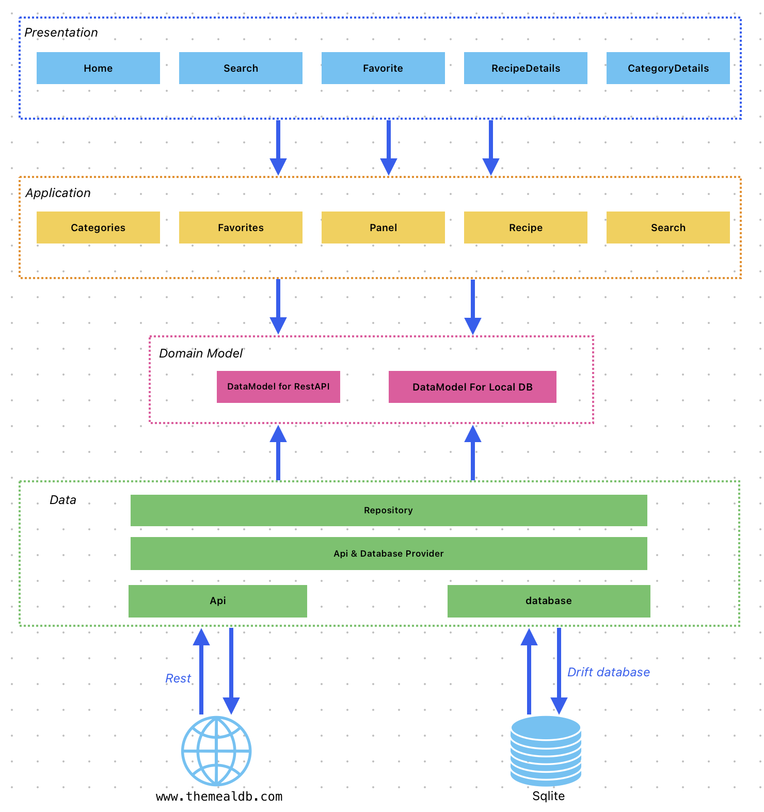
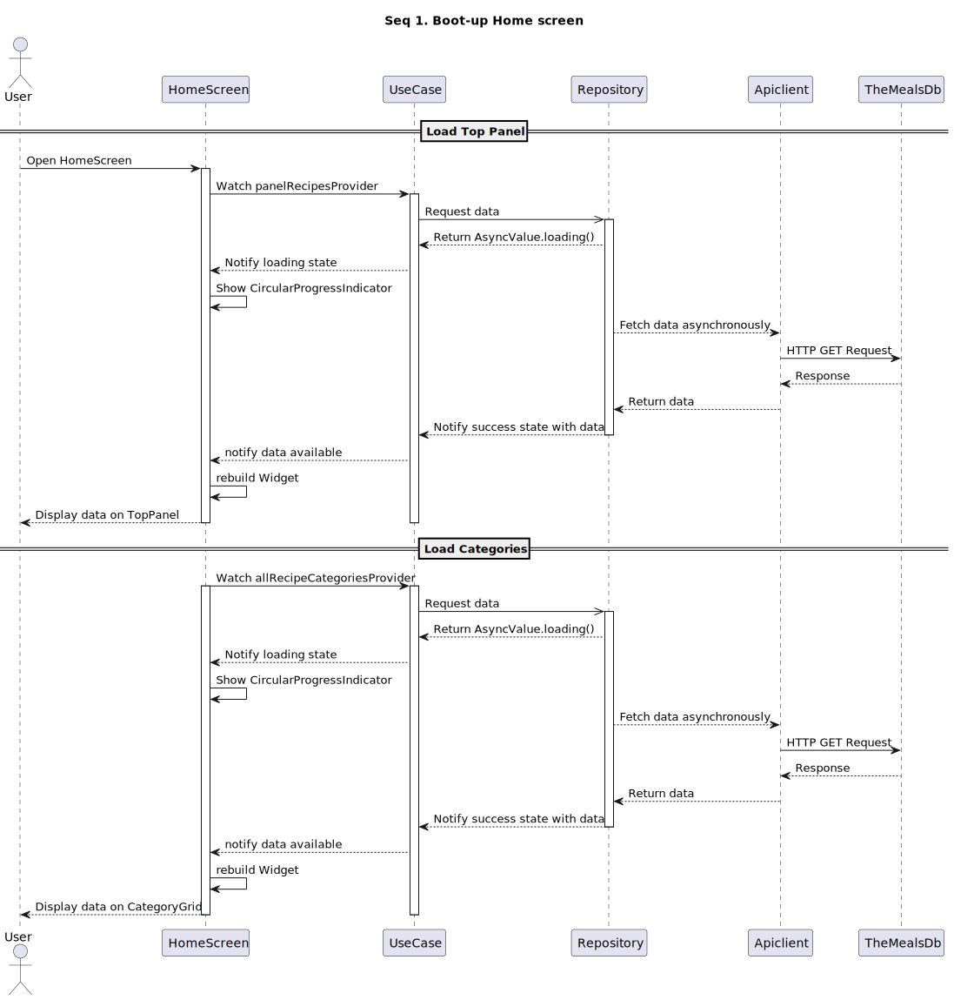
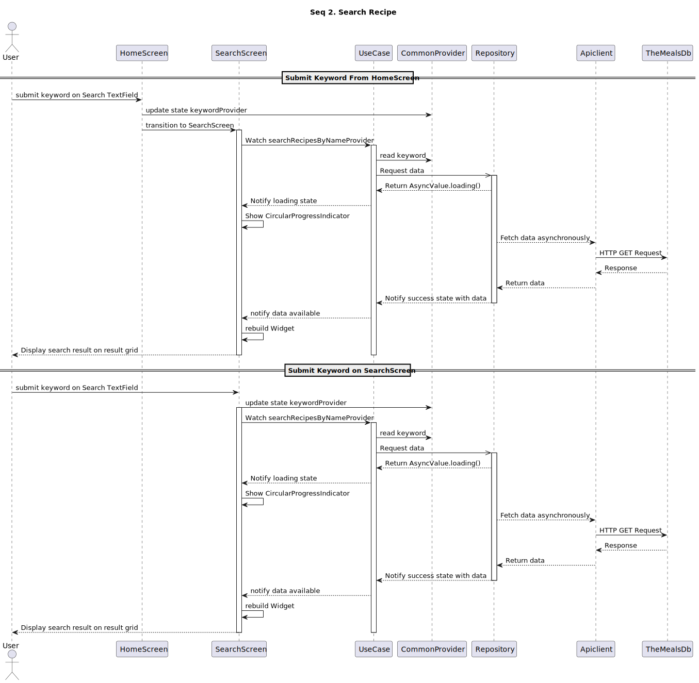
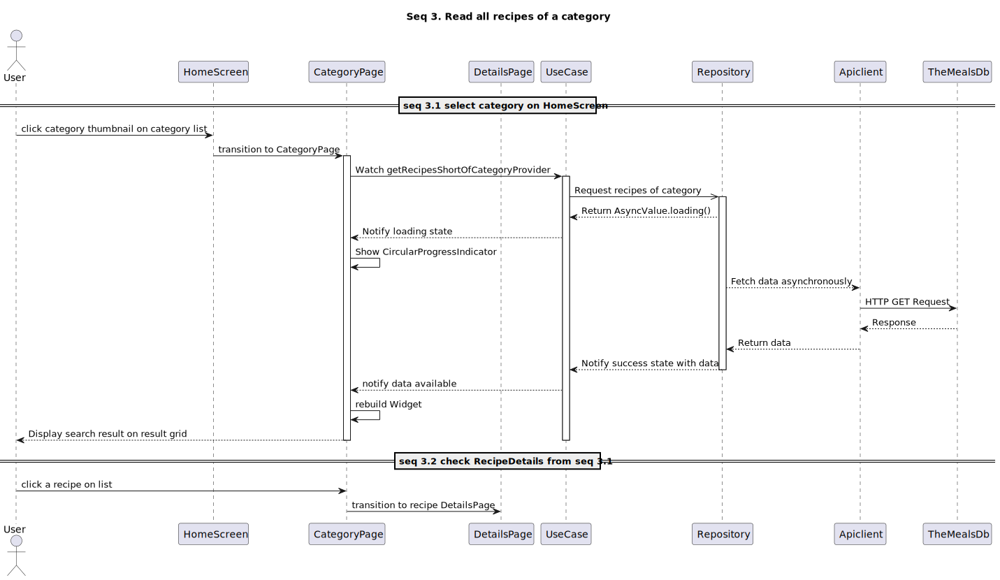
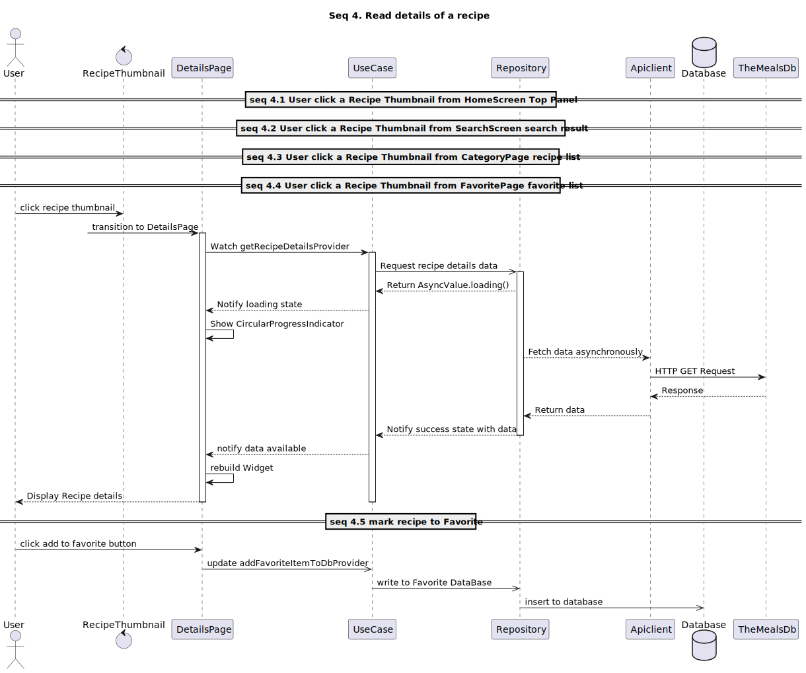
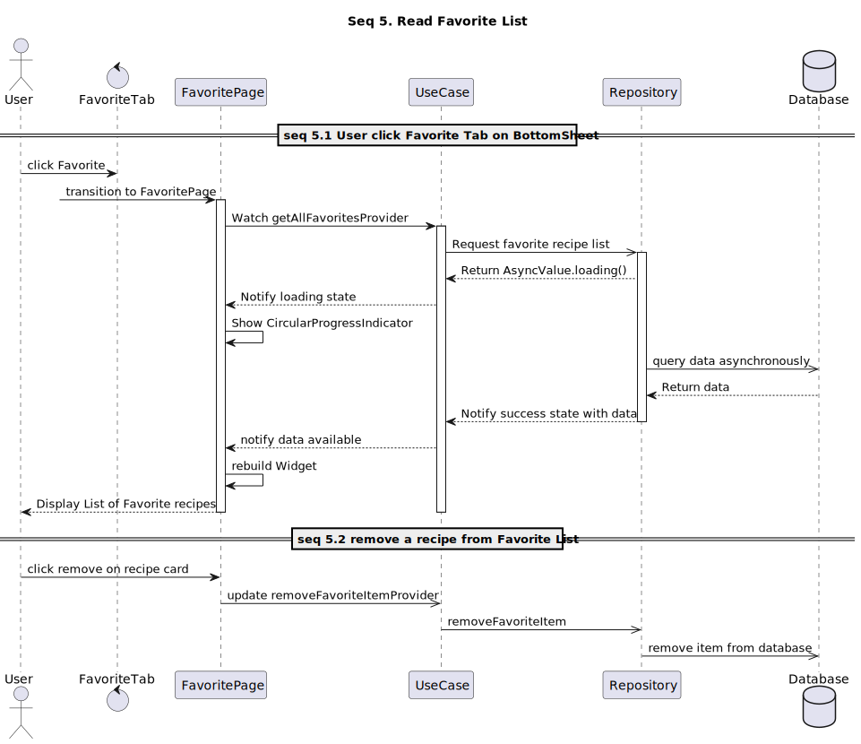

# Find Recipe

A Flutter Sample Base on Riverpod 2.x

## 1. Introduction
* This is a sample applied the template public at [RiverPod Template](https://github.com/monstar-lab-oss/flutter-template-riverpod)
* The main function of the application will be as following
  * Show the available recipes on Screens which the data fetch from RecipeAPI www.themealdb.com
  * Allow user to search by inputing recipe name or related keyword
  * Allow user to browse all available recipes of a certain category
  * Allow user to read the detail of a recipe
  * Allow user to mark a recipe to favorites list or remove from favorite list
## 2. Screen Design and Screen Transition
* **Screens**
  | No | Screen Name | Description|
  |----|-------------|------------|
  |1   | Home        | The Home screen includes a slide pannel which will randomly pick up one of 12 available categories each time the app restarts. <br> The available categories will be show on Home screen.|
  | 2 | Search | The Search screen where the search result will be displayed and the search operation could be also run.|
  | 3 | Favorites| The Favorites Screen will show all favorite recipes|
  | 4 | Recipe Details| The details of a recipe will be show here. 
  | 5 | Category Details| All the recipes related to a category could be found in this screen. 

* **Screen Transition**


## 3. Application Architecture
* The application structured base the Riverpod Template and Guideline.
* Layer Role Description
  | No | Layer Name | Description|
  |----|------------|-------------|
  |1   | presentation| The UI and UI interaction implementation Layer|
  |2 | application | All the usecase are covered here. The Presentation Layer will interact with Data layer for each specific usecase via this layer.
  |3 | model | All the data for Network Data and Local Database Data are implement here. The Application and Data layer will use this model for it's logic.
  | 4 | data | all data control including query network or local database are incharged by this layer.
* The structure of the application would be as following


## 4. How to build
* The app uses riverpod codegen and freeze codegen and drift package, so we need to run the build_runner at least when the related module have changed to build.
- run below command
  ```
  flutter pub get
  flutter packages pub run build_runner build   --delete-conflicting-outputs
  ```
* To run app on simulator, please use development-debug flavor
* To run app on device, please use production-release
## 5. Main Workflow
* **Boot up Home Screen**
  
* **Search recipe by keyword**
  
* **Read all recipes of a category**
    
* **Read Details of a recipe**
   
* **Read favorite recipes**
  

## 6. Demo

## 7. Reference Document
- [Flutter Riverpod Architecture](https://codewithandrea.com/articles/flutter-app-architecture-riverpod-introduction/)
  - Presentation, Application, Domain and Data Layers.
- Freezed Code Generation
- Riverpod Provider Generation
- Retrofit API calls, `toJson` function Generation.

- Local database - Drift package (formerly named moor)
 [refer to document](https://drift.simonbinder.eu/docs/getting-started/)
The package build on top of sqlite, providing advantages almost same with Room on Android.
We can borrow the concept from android to implement the database structure like DAOs


- Localization
  - ref https://docs.flutter.dev/development/accessibility-and-localization/  internationalization
  - define localization string file in app_en.arb, app_ja.arb it will be automatically  generated to use.
  - use example - AppLocalizations.of(context)!.home_tab_profile

For help getting started with Flutter development, view the
[online documentation](https://docs.flutter.dev/), which offers tutorials, samples, guidance on
mobile development, and a full API reference.