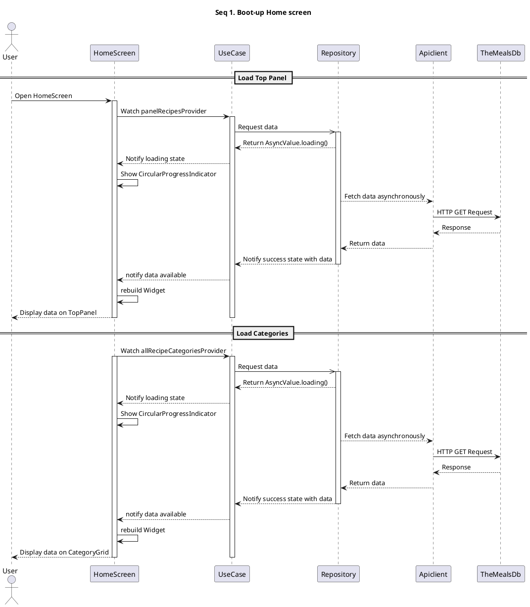

```plantuml
@startuml
title Seq 1. Boot-up Home screen
actor User
participant HomeScreen
participant UseCase
participant Repository
participant Apiclient
participant TheMealsDb
== Load Top Panel ==
User -> HomeScreen: Open HomeScreen

activate HomeScreen
    HomeScreen -> UseCase: Watch panelRecipesProvider
    activate UseCase
        UseCase ->> Repository: Request data
        activate Repository
            Repository --> UseCase: Return AsyncValue.loading()
            UseCase --> HomeScreen: Notify loading state
            HomeScreen -> HomeScreen: Show CircularProgressIndicator
            Repository --> Apiclient: Fetch data asynchronously
            Apiclient -> TheMealsDb: HTTP GET Request
            TheMealsDb --> Apiclient: Response
            Apiclient --> Repository: Return data
            UseCase <-- Repository: Notify success state with data
        deactivate Repository
        UseCase --> HomeScreen: notify data available
        HomeScreen -> HomeScreen: rebuild Widget
        HomeScreen --> User: Display data on TopPanel
    deactivate UseCase
deactivate HomeScreen

== Load Categories ==
HomeScreen -> UseCase: Watch allRecipeCategoriesProvider
activate HomeScreen
    activate UseCase
        UseCase ->> Repository: Request data
        activate Repository
            Repository --> UseCase: Return AsyncValue.loading()
            UseCase --> HomeScreen: Notify loading state
            HomeScreen -> HomeScreen: Show CircularProgressIndicator
            Repository --> Apiclient: Fetch data asynchronously
            Apiclient -> TheMealsDb: HTTP GET Request
            TheMealsDb --> Apiclient: Response
            Apiclient --> Repository: Return data
            UseCase <-- Repository: Notify success state with data
        deactivate Repository
        UseCase --> HomeScreen: notify data available
        HomeScreen -> HomeScreen: rebuild Widget
        HomeScreen --> User: Display data on CategoryGrid
    deactivate UseCase
deactivate HomeScreen
@enduml
```
* install plant uml on mac
  * brew install graphviz
  * brew install plantuml 
* generate svg image from plantuml diagram
  *  plantuml -tsvg \<Markdown document contain plantuml code\>