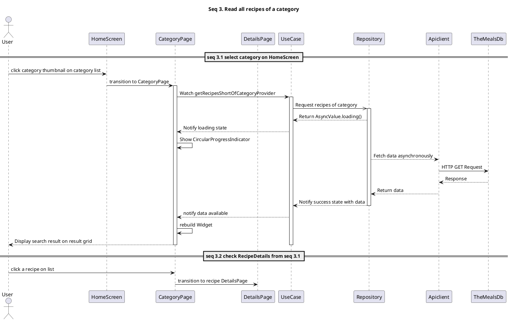

```plantuml
@startuml
title Seq 3. Read all recipes of a category
actor User
participant HomeScreen
participant CategoryPage
participant DetailsPage
participant UseCase
participant Repository
participant Apiclient
participant TheMealsDb
== seq 3.1 select category on HomeScreen ==
User -> HomeScreen: click category thumbnail on category list
HomeScreen -> CategoryPage: transition to CategoryPage
activate CategoryPage
    CategoryPage -> UseCase: Watch getRecipesShortOfCategoryProvider
    activate UseCase
        UseCase ->> Repository: Request recipes of category
        activate Repository
            Repository --> UseCase: Return AsyncValue.loading()
            UseCase --> CategoryPage: Notify loading state
            CategoryPage -> CategoryPage: Show CircularProgressIndicator
            Repository --> Apiclient: Fetch data asynchronously
            Apiclient -> TheMealsDb: HTTP GET Request
            TheMealsDb --> Apiclient: Response
            Apiclient --> Repository: Return data
            UseCase <-- Repository: Notify success state with data
        deactivate Repository
        UseCase --> CategoryPage: notify data available
        CategoryPage -> CategoryPage: rebuild Widget
        CategoryPage --> User: Display search result on result grid
    deactivate UseCase
deactivate CategoryPage

== seq 3.2 check RecipeDetails from seq 3.1 ==
User -> CategoryPage: click a recipe on list
CategoryPage -> DetailsPage: transition to recipe DetailsPage
@enduml
```