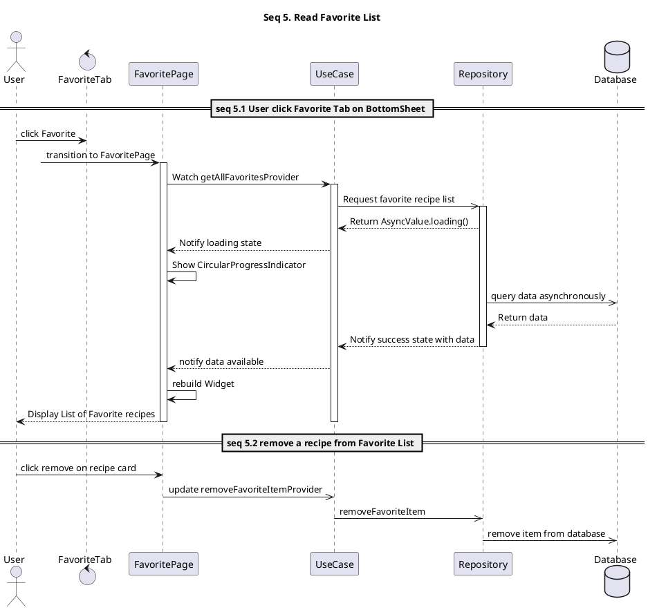

```plantuml
@startuml
title Seq 5. Read Favorite List
actor User
control FavoriteTab
participant FavoritePage
participant UseCase
participant Repository
database Database
== seq 5.1 User click Favorite Tab on BottomSheet ==
User -> FavoriteTab: click Favorite
?-> FavoritePage: transition to FavoritePage
activate FavoritePage
    FavoritePage -> UseCase: Watch getAllFavoritesProvider
    activate UseCase
        UseCase ->> Repository: Request favorite recipe list
        activate Repository
            Repository --> UseCase: Return AsyncValue.loading()
            UseCase --> FavoritePage: Notify loading state
            FavoritePage -> FavoritePage: Show CircularProgressIndicator
            Repository ->> Database: query data asynchronously
            Database --> Repository: Return data
            UseCase <-- Repository: Notify success state with data
        deactivate Repository
        UseCase --> FavoritePage: notify data available
        FavoritePage -> FavoritePage: rebuild Widget
        FavoritePage --> User: Display List of Favorite recipes
    deactivate UseCase
deactivate FavoritePage

== seq 5.2 remove a recipe from Favorite List ==
User -> FavoritePage: click remove on recipe card
FavoritePage ->> UseCase: update removeFavoriteItemProvider
UseCase ->> Repository: removeFavoriteItem
Repository ->> Database: remove item from database
@enduml
```