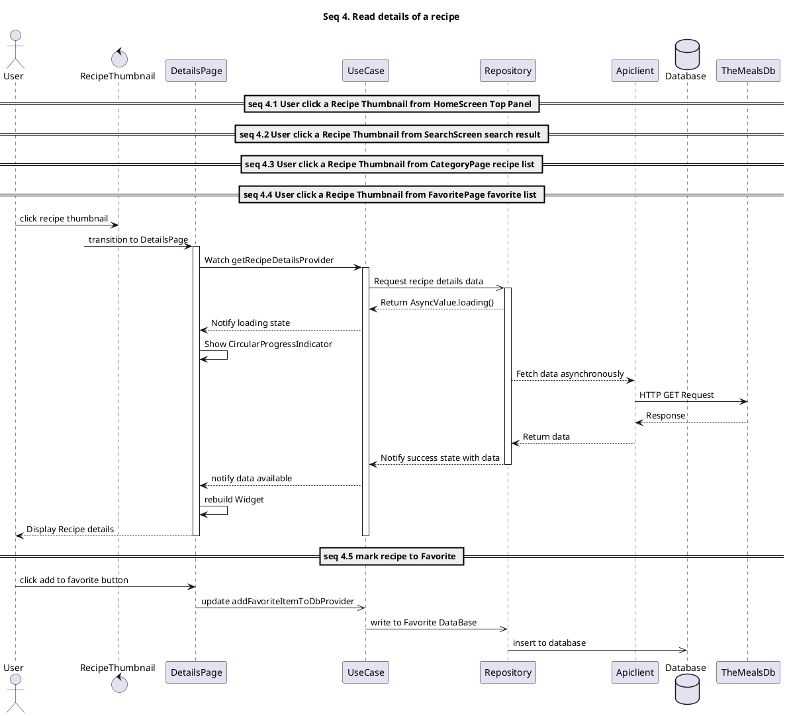

```plantuml
@startuml
title Seq 4. Read details of a recipe
actor User
control RecipeThumbnail
participant DetailsPage
participant UseCase
participant Repository
participant Apiclient
database Database
participant TheMealsDb
== seq 4.1 User click a Recipe Thumbnail from HomeScreen Top Panel ==
== seq 4.2 User click a Recipe Thumbnail from SearchScreen search result ==
== seq 4.3 User click a Recipe Thumbnail from CategoryPage recipe list ==
== seq 4.4 User click a Recipe Thumbnail from FavoritePage favorite list ==
User -> RecipeThumbnail: click recipe thumbnail
?-> DetailsPage: transition to DetailsPage
activate DetailsPage
    DetailsPage -> UseCase: Watch getRecipeDetailsProvider
    activate UseCase
        UseCase ->> Repository: Request recipe details data
        activate Repository
            Repository --> UseCase: Return AsyncValue.loading()
            UseCase --> DetailsPage: Notify loading state
            DetailsPage -> DetailsPage: Show CircularProgressIndicator
            Repository --> Apiclient: Fetch data asynchronously
            Apiclient -> TheMealsDb: HTTP GET Request
            TheMealsDb --> Apiclient: Response
            Apiclient --> Repository: Return data
            UseCase <-- Repository: Notify success state with data
        deactivate Repository
        UseCase --> DetailsPage: notify data available
        DetailsPage -> DetailsPage: rebuild Widget
        DetailsPage --> User: Display Recipe details
    deactivate UseCase
deactivate DetailsPage

== seq 4.5 mark recipe to Favorite ==
User -> DetailsPage: click add to favorite button
DetailsPage ->> UseCase: update addFavoriteItemToDbProvider
UseCase ->> Repository: write to Favorite DataBase
Repository ->> Database: insert to database
@enduml
```