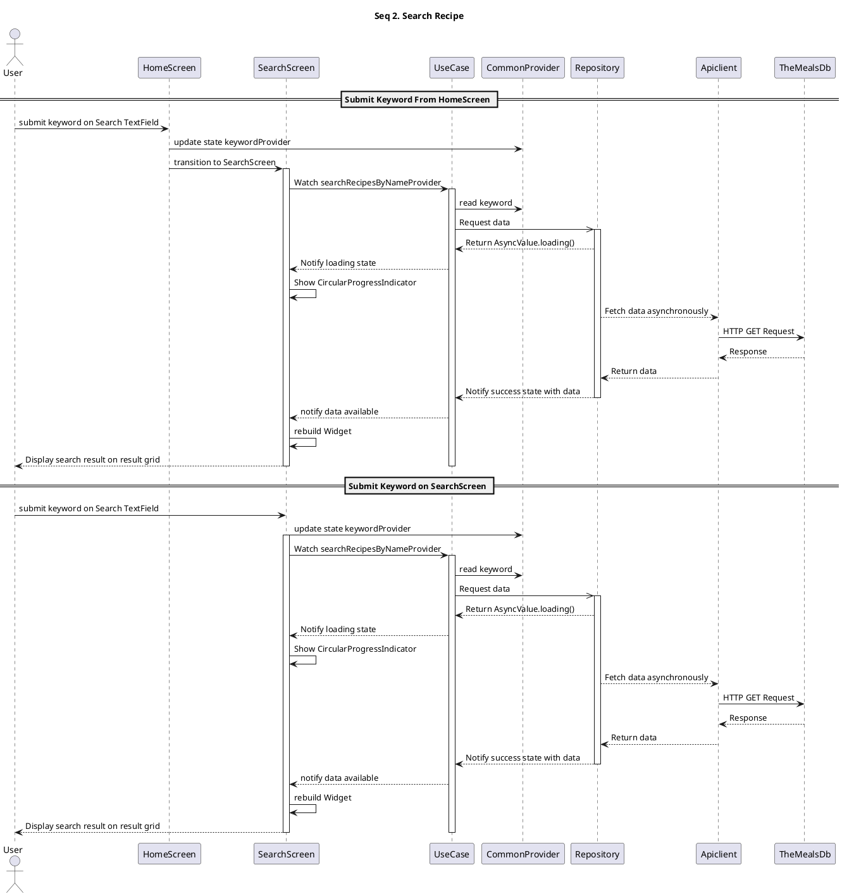

```plantuml
@startuml
title Seq 2. Search Recipe
actor User
participant HomeScreen
participant SearchScreen
participant UseCase
participant CommonProvider
participant Repository
participant Apiclient
participant TheMealsDb
== Submit Keyword From HomeScreen ==
User -> HomeScreen: submit keyword on Search TextField
HomeScreen -> CommonProvider: update state keywordProvider
HomeScreen -> SearchScreen: transition to SearchScreen
activate SearchScreen
    SearchScreen -> UseCase: Watch searchRecipesByNameProvider
    activate UseCase
        UseCase -> CommonProvider: read keyword
        UseCase ->> Repository: Request data
        activate Repository
            Repository --> UseCase: Return AsyncValue.loading()
            UseCase --> SearchScreen: Notify loading state
            SearchScreen -> SearchScreen: Show CircularProgressIndicator
            Repository --> Apiclient: Fetch data asynchronously
            Apiclient -> TheMealsDb: HTTP GET Request
            TheMealsDb --> Apiclient: Response
            Apiclient --> Repository: Return data
            UseCase <-- Repository: Notify success state with data
        deactivate Repository
        UseCase --> SearchScreen: notify data available
        SearchScreen -> SearchScreen: rebuild Widget
        SearchScreen --> User: Display search result on result grid
    deactivate UseCase
deactivate SearchScreen

== Submit Keyword on SearchScreen ==
User -> SearchScreen: submit keyword on Search TextField
SearchScreen -> CommonProvider: update state keywordProvider
activate SearchScreen
    SearchScreen -> UseCase: Watch searchRecipesByNameProvider
    activate UseCase
        UseCase -> CommonProvider: read keyword
        UseCase ->> Repository: Request data
        activate Repository
            Repository --> UseCase: Return AsyncValue.loading()
            UseCase --> SearchScreen: Notify loading state
            SearchScreen -> SearchScreen: Show CircularProgressIndicator
            Repository --> Apiclient: Fetch data asynchronously
            Apiclient -> TheMealsDb: HTTP GET Request
            TheMealsDb --> Apiclient: Response
            Apiclient --> Repository: Return data
            UseCase <-- Repository: Notify success state with data
        deactivate Repository
        UseCase --> SearchScreen: notify data available
        SearchScreen -> SearchScreen: rebuild Widget
        SearchScreen --> User: Display search result on result grid
    deactivate UseCase
deactivate SearchScreen
@enduml
```